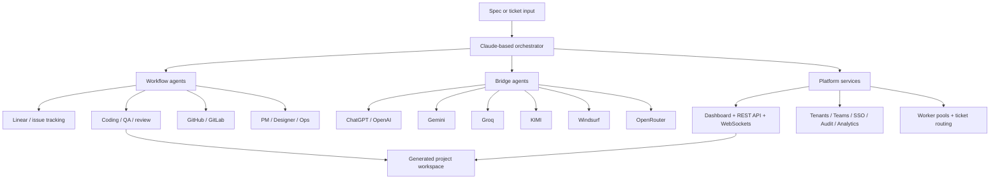

# Agent Engineers

A software engineering system built on the Claude Agent SDK.

This repository combines:

- A multi-agent orchestration harness
- External AI provider bridges
- A dashboard and REST API
- Multi-tenant and platform modules
- SSO, audit logging, analytics, teams, and knowledge base modules

## What The Repository Actually Contains

The codebase currently spans three major layers:

| Layer | Purpose | Key Paths |
| --- | --- | --- |
| Engineering harness | Runs orchestrated coding sessions against generated projects | [`agent.py`](/Users/bkh223/Documents/GitHub/agent-engineers/agent.py), [`agents/`](/Users/bkh223/Documents/GitHub/agent-engineers/agents), [`scripts/autonomous_agent_demo.py`](/Users/bkh223/Documents/GitHub/agent-engineers/scripts/autonomous_agent_demo.py) |
| Dashboard and control surfaces | Serves monitoring UIs, chat, metrics, WebSockets, REST APIs, and webhook endpoints | [`dashboard/`](/Users/bkh223/Documents/GitHub/agent-engineers/dashboard), [`scripts/dashboard_server.py`](/Users/bkh223/Documents/GitHub/agent-engineers/scripts/dashboard_server.py) |
| Platform modules | Adds tenants, projects, teams, analytics, audit, memory, SSO, and daemonized worker pools | [`tenants/`](/Users/bkh223/Documents/GitHub/agent-engineers/tenants), [`projects/`](/Users/bkh223/Documents/GitHub/agent-engineers/projects), [`teams/`](/Users/bkh223/Documents/GitHub/agent-engineers/teams), [`analytics/`](/Users/bkh223/Documents/GitHub/agent-engineers/analytics), [`audit/`](/Users/bkh223/Documents/GitHub/agent-engineers/audit), [`sso/`](/Users/bkh223/Documents/GitHub/agent-engineers/sso), [`daemon/`](/Users/bkh223/Documents/GitHub/agent-engineers/daemon) |

## Core Architecture



## Agent Model

The README previously described the system as a fixed 16-agent setup. The repository has grown beyond that baseline.

Today, the registry in [`agents/definitions.py`](/Users/bkh223/Documents/GitHub/agent-engineers/agents/definitions.py) includes:

- Core workflow agents: `linear`, `coding`, `coding_fast`, `github`, `slack`, `pr_reviewer`, `pr_reviewer_fast`, `ops`
- Planning and design agents: `product_manager`, `designer`
- Provider bridge agents: `chatgpt`, `gemini`, `groq`, `kimi`, `windsurf`, `openrouter_dev`
- Additional agents: `jira`, `gitlab`, `knowledge_base`, `qa`, `security_reviewer`

The repository is not limited to a fixed demo configuration.

## Key Capabilities

- Project initialization from a spec into a generated workspace
- Ticket-driven orchestration through Linear-style workflows
- Git automation for branches, commits, PRs, and review loops
- Provider bridging for OpenAI, Gemini, Groq, KIMI, Windsurf, and OpenRouter
- Dashboard updates over HTTP and WebSockets
- Multi-project, multi-tenant, and platform views
- Optional auth, SSO, SCIM, audit logging, analytics, and knowledge base features

## Running The Project

### Requirements

- Python 3.11+
- Node.js 18+
- Claude Code CLI login for Claude Agent SDK usage
- Arcade gateway credentials if you want external service integrations

### Setup

```bash
git clone https://github.com/kennylhilljr/Agent-Engineers.git
cd Agent-Engineers

python3 -m venv venv
source venv/bin/activate
pip install -r requirements.txt

cp .env.example .env
```

Then update `.env` with the pieces you actually want to use:

- `ARCADE_API_KEY`
- `ARCADE_GATEWAY_SLUG`
- Optional provider keys such as `GROQ_API_KEY`, `KIMI_API_KEY`, `OPENROUTER_API_KEY`
- Optional repo and notification settings such as `GITHUB_REPO` and `SLACK_CHANNEL`

If you are using Arcade-backed integrations, authorize them:

```bash
python scripts/authorize_arcade.py
```

### Start A Session

```bash
uv run python scripts/autonomous_agent_demo.py --project-dir my-app
```

Flags:

- `--model haiku|sonnet|opus`
- `--max-iterations N`
- `--generations-base /absolute/path`

Generated projects default to `./generations/<project-name>/`.

## Dashboard Options

This repository currently has two dashboard entrypoints.

| Mode | Entry Point | Default Port | Notes |
| --- | --- | --- | --- |
| Metrics dashboard | [`scripts/dashboard_server.py`](/Users/bkh223/Documents/GitHub/agent-engineers/scripts/dashboard_server.py) | `8420` | Project metrics and monitoring |
| Dashboard and API server | [`dashboard/server.py`](/Users/bkh223/Documents/GitHub/agent-engineers/dashboard/server.py) | `8080` | REST API, WebSocket support, auth, provider/chat endpoints, and platform routes |

Lightweight dashboard:

```bash
python scripts/dashboard_server.py --project-dir generations/my-app
```

Full dashboard server:

```bash
python -m dashboard.server
```

## Repository Map

```text
agent-engineers/
├── agent.py
├── agents/
├── analytics/
├── audit/
├── bridges/
├── daemon/
├── dashboard/
├── docs/
├── generations/
├── knowledge_base/
├── memory/
├── projects/
├── prompts/
├── scripts/
├── specs/
├── sso/
├── teams/
└── tenants/
```

Key paths:

- [`bridges/`](/Users/bkh223/Documents/GitHub/agent-engineers/bridges): provider integrations and bridge docs
- [`prompts/`](/Users/bkh223/Documents/GitHub/agent-engineers/prompts): orchestrator and agent system prompts
- [`dashboard/index.html`](/Users/bkh223/Documents/GitHub/agent-engineers/dashboard/index.html): main dashboard UI
- [`dashboard/platform/`](/Users/bkh223/Documents/GitHub/agent-engineers/dashboard/platform): platform views
- [`dashboard/customer/`](/Users/bkh223/Documents/GitHub/agent-engineers/dashboard/customer): customer-facing tenant views
- [`docs/`](/Users/bkh223/Documents/GitHub/agent-engineers/docs): architecture, deployment, operations, and API docs

## Integrations

The codebase includes integrations for:

- Claude Agent SDK
- Arcade MCP for Linear, GitHub, Slack, and related service access
- Playwright for browser testing
- OpenAI / ChatGPT bridge
- Gemini bridge
- Groq bridge
- KIMI bridge
- Windsurf bridge
- OpenRouter bridge

Some integrations are optional and require configuration before use.

## Multi-Tenant Scope

This repository also includes platform features such as:

- Tenant isolation and tenant-scoped data paths
- Team and role-based access
- Platform dashboards
- Audit logging
- SSO, OIDC, SAML, SCIM, and JIT provisioning
- Analytics and benchmarking
- Knowledge base retrieval and shared memory systems

For architecture details, start with:

- [`docs/MULTI_TENANT_ARCHITECTURE.md`](/Users/bkh223/Documents/GitHub/agent-engineers/docs/MULTI_TENANT_ARCHITECTURE.md)
- [`docs/BRIDGE_INTERFACE.md`](/Users/bkh223/Documents/GitHub/agent-engineers/docs/BRIDGE_INTERFACE.md)
- [`docs/API.md`](/Users/bkh223/Documents/GitHub/agent-engineers/docs/API.md)
- [`docs/DEPLOYMENT.md`](/Users/bkh223/Documents/GitHub/agent-engineers/docs/DEPLOYMENT.md)
- [`docs/OPERATIONS_RUNBOOK.md`](/Users/bkh223/Documents/GitHub/agent-engineers/docs/OPERATIONS_RUNBOOK.md)

## Notes

- The repo contains both demo-style surfaces and platform modules.
- The generated-project flow and the platform/dashboard code have evolved at different speeds, so command paths and port defaults matter.
- `windsurfinabox/` is present as a nested dependency/worktree-style directory and currently shows as untracked in `git status`.

## License

MIT. See [`LICENSE`](/Users/bkh223/Documents/GitHub/agent-engineers/LICENSE).
