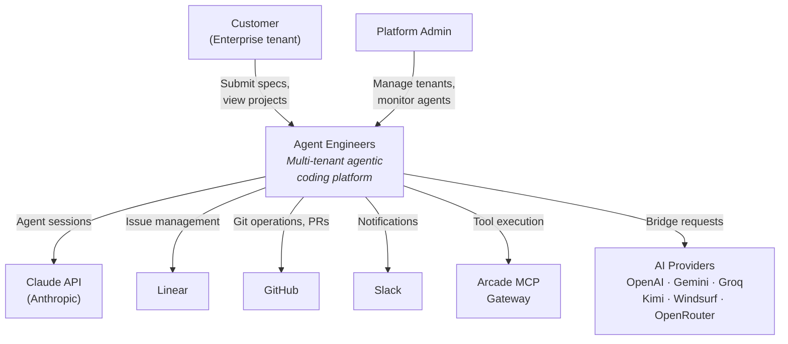
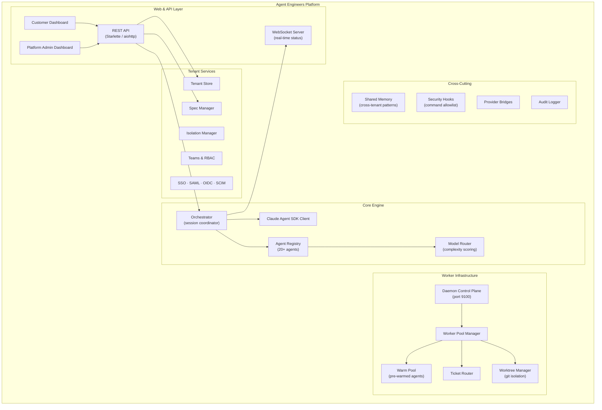
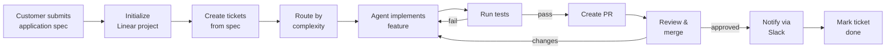
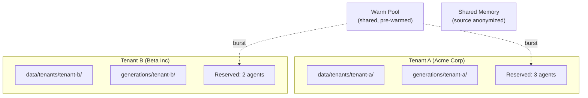

# Agent Engineers

An enterprise multi-tenant agentic coding platform built on the Claude Agent SDK.

Customers submit application specifications through a web interface and AI agents build them autonomously — managing issues in Linear, writing code, creating pull requests, running tests, and notifying teams via Slack.

## System Context



## Component Architecture



## Agent Orchestration

```mermaid
graph TB
    Orch["Orchestrator<br/><i>sonnet</i>"]

    subgraph Workflow["Workflow Agents"]
        LINEAR["LINEAR<br/><i>haiku</i>"]
        CODING["CODING<br/><i>sonnet</i>"]
        CODING_FAST["CODING_FAST<br/><i>haiku</i>"]
        GITHUB_AG["GITHUB<br/><i>haiku</i>"]
        PR_REV["PR_REVIEWER<br/><i>sonnet</i>"]
        OPS["OPS<br/><i>haiku</i>"]
        SLACK_AG["SLACK<br/><i>haiku</i>"]
    end

    subgraph Bridge["Provider Bridges"]
        CHATGPT["ChatGPT"]
        GEMINI["Gemini"]
        GROQ["Groq"]
        KIMI["Kimi"]
        WINDSURF["Windsurf"]
        OPENROUTER["OpenRouter"]
    end

    subgraph Specialist["Specialized"]
        PM["Product Manager<br/><i>sonnet</i>"]
        DESIGNER["Designer<br/><i>sonnet</i>"]
        QA["QA<br/><i>sonnet</i>"]
        SEC["Security Reviewer<br/><i>sonnet</i>"]
    end

    Orch --> LINEAR & CODING & CODING_FAST & GITHUB_AG & PR_REV & OPS & SLACK_AG
    Orch --> CHATGPT & GEMINI & GROQ & KIMI & WINDSURF & OPENROUTER
    Orch --> PM & DESIGNER & QA & SEC
```



## Session Lifecycle

```mermaid
sequenceDiagram
    participant Loop as Session Loop
    participant Client as SDK Client
    participant Claude as Claude API
    participant Tools as MCP Tools

    loop Until PROJECT_COMPLETE
        Loop->>Client: create_client() — fresh context
        Loop->>Client: run_agent_session(prompt)
        Client->>Claude: query(message)

        loop Agent Work
            Claude->>Tools: ToolUseBlock
            Tools-->>Claude: ToolResultBlock
        end

        Claude-->>Client: TextBlock (response)
        Client-->>Loop: SessionResult

        alt status = COMPLETE
            Loop->>Loop: break
        else status = CONTINUE
            Loop->>Loop: next iteration
        else status = ERROR
            Loop->>Loop: retry with fresh session
        end
    end
```

## Spec-to-Delivery Pipeline



## Multi-Tenant Isolation



Each tenant gets isolated directories, agent pool allocations, and optional SSO configuration. The shared memory system captures cross-tenant patterns while keeping the source tenant anonymous.

## Running The Project

### Requirements

- Python 3.11+
- Node.js 18+
- Claude CLI authentication (`claude login`)
- Arcade gateway credentials (optional, for external tool integrations)

### Setup

```bash
git clone https://github.com/kennylhilljr/Agent-Engineers.git
cd Agent-Engineers

# Install dependencies and pre-commit hooks
make dev

# Configure environment
cp .env.example .env
# Edit .env — see .env.example for all variables
```

### Start A Session

```bash
uv run python scripts/autonomous_agent_demo.py --project-dir my-app
```

Flags: `--model haiku|sonnet|opus`, `--max-iterations N`, `--generations-base /path`

### Dashboard

| Mode | Entry Point | Port | Description |
|------|-------------|------|-------------|
| Metrics | `scripts/dashboard_server.py` | 8420 | Project metrics and monitoring |
| Full | `dashboard/server.py` | 8080 | REST API, WebSockets, auth, platform routes |

```bash
# Lightweight metrics dashboard
python scripts/dashboard_server.py --project-dir generations/my-app

# Full dashboard + API server
python -m dashboard.server
```

### Development

```bash
make test          # Run test suite
make lint          # Ruff linter
make format        # Ruff formatter
make typecheck     # mypy type checking
make security-audit # Security hook tests
make clean         # Remove build artifacts
```

## Repository Map

```text
agent-engineers/
├── agent.py                Core agent session loop
├── client.py               Claude SDK client configuration
├── security.py             Bash command security hooks (allowlist)
├── agents/                 Agent definitions, orchestrator, model routing
├── bridges/                External AI provider bridges
├── daemon/                 Scalable ticket processing (worker pools)
├── dashboard/              Web UI, REST API, WebSocket server
│   ├── customer/           Customer-facing dashboards
│   ├── platform/           Platform admin dashboards
│   └── auth/               Authentication (OAuth, sessions)
├── tenants/                Multi-tenant infrastructure
├── teams/                  Team management and RBAC
├── sso/                    Enterprise SSO (SAML, OIDC, SCIM)
├── memory/                 Cross-tenant shared memory
├── specs/                  Spec lifecycle management
├── audit/                  Event auditing and compliance
├── analytics/              Cost optimization and metrics
├── prompts/                Agent system prompts (21+ files)
├── scripts/                CLI tools and utilities
├── tests/                  Test suite (100+ tests)
├── docs/                   Architecture, API, deployment docs
│   └── architecture/       Mermaid architectural diagrams
└── deploy/                 Terraform, Docker, CI/CD configs
```

## Documentation

| Document | Description |
|----------|-------------|
| [Architecture Diagrams](docs/architecture/) | C4 context, containers, agents, tenants, security, deployment |
| [Multi-Tenant Architecture](docs/MULTI_TENANT_ARCHITECTURE.md) | Tenant isolation and data partitioning |
| [Bridge Interface](docs/BRIDGE_INTERFACE.md) | AI provider bridge protocol |
| [API Reference](docs/API.md) | REST API endpoints |
| [Deployment Guide](docs/DEPLOYMENT.md) | AWS infrastructure and CI/CD |
| [Operations Runbook](docs/OPERATIONS_RUNBOOK.md) | Operational procedures |
| [Developer Guide](docs/DEVELOPER_GUIDE.md) | Contributing and development setup |
| [Security Audit](SECURITY.md) | Security model and dependency audit |

## License

MIT. See [LICENSE](LICENSE).
