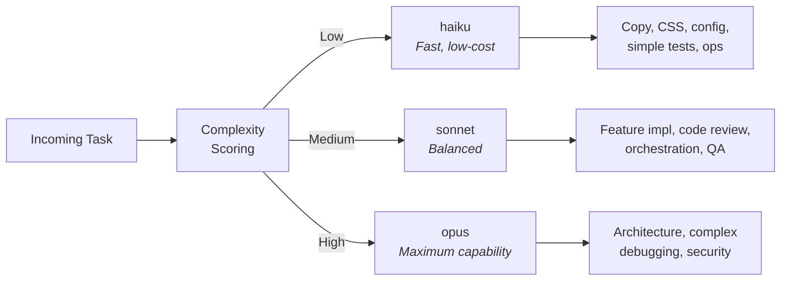

# Agent Orchestration

Agent hierarchy, model routing, and delegation patterns.

## Agent Hierarchy

```mermaid
graph TB
    ORCH["Orchestrator<br/><i>sonnet — session coordinator</i>"]

    subgraph Workflow ["Workflow Agents"]
        LINEAR["LINEAR<br/><i>haiku</i>"]
        CODING["CODING<br/><i>sonnet</i>"]
        CODING_FAST["CODING_FAST<br/><i>haiku</i>"]
        GITHUB_AG["GITHUB<br/><i>haiku</i>"]
        PR_REV["PR_REVIEWER<br/><i>sonnet</i>"]
        PR_REV_FAST["PR_REVIEWER_FAST<br/><i>haiku</i>"]
        OPS["OPS<br/><i>haiku</i>"]
        SLACK_AG["SLACK<br/><i>haiku</i>"]
    end

    subgraph Bridge ["Bridge Agents"]
        CHATGPT["CHATGPT"]
        GEMINI_AG["GEMINI"]
        GROQ_AG["GROQ"]
        KIMI_AG["KIMI"]
        WINDSURF_AG["WINDSURF"]
        OPENROUTER["OPENROUTER_DEV"]
    end

    subgraph Specialist ["Specialized Agents"]
        PM["PRODUCT_MANAGER<br/><i>sonnet</i>"]
        DESIGNER["DESIGNER<br/><i>sonnet</i>"]
        QA["QA<br/><i>sonnet</i>"]
        SEC_REV["SECURITY_REVIEWER<br/><i>sonnet</i>"]
    end

    ORCH --> LINEAR
    ORCH --> CODING
    ORCH --> CODING_FAST
    ORCH --> GITHUB_AG
    ORCH --> PR_REV
    ORCH --> PR_REV_FAST
    ORCH --> OPS
    ORCH --> SLACK_AG
    ORCH --> CHATGPT
    ORCH --> GEMINI_AG
    ORCH --> GROQ_AG
    ORCH --> KIMI_AG
    ORCH --> WINDSURF_AG
    ORCH --> OPENROUTER
    ORCH --> PM
    ORCH --> DESIGNER
    ORCH --> QA
    ORCH --> SEC_REV
```



## Model Routing



## Session Lifecycle

```mermaid
sequenceDiagram
    participant Loop as Session Loop
    participant Client as SDK Client
    participant Claude as Claude API
    participant Tools as MCP Tools

    loop Until PROJECT_COMPLETE
        Loop->>Client: create_client() [fresh context]
        Loop->>Client: run_agent_session(prompt)
        Client->>Claude: query(message)

        loop Agent Work
            Claude->>Tools: ToolUseBlock (e.g., file write)
            Tools-->>Claude: ToolResultBlock
        end

        Claude-->>Client: TextBlock (response)
        Client-->>Loop: SessionResult

        alt status == COMPLETE
            Loop->>Loop: Break — all features done
        else status == CONTINUE
            Loop->>Loop: Next iteration
        else status == ERROR
            Loop->>Loop: Retry with fresh session
        end
    end
```

## Agent Roles

| Agent | Model | Responsibility |
|-------|-------|---------------|
| **Orchestrator** | sonnet | Coordinates work, delegates to sub-agents |
| **LINEAR** | haiku | Creates/updates Linear issues and projects |
| **CODING** | sonnet | Implements features, writes code, runs Playwright tests |
| **CODING_FAST** | haiku | Simple changes — copy, CSS, config, tests |
| **GITHUB** | haiku | Git operations, branch management, PRs |
| **PR_REVIEWER** | sonnet | Automated code review and merge decisions |
| **OPS** | haiku | Batch operations across Linear + Slack + GitHub |
| **SLACK** | haiku | Progress notifications to team channels |
| **PRODUCT_MANAGER** | sonnet | Backlog grooming, feature prioritization |
| **DESIGNER** | sonnet | UI/UX specifications and design tokens |
| **QA** | sonnet | Test automation and quality assurance |
| **SECURITY_REVIEWER** | sonnet | Security audit and vulnerability assessment |
