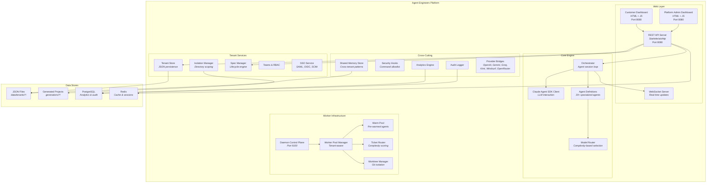

# Container Diagram (C4 Level 2)

Deployable units and data stores within the Agent Engineers platform.

## Container Descriptions

| Container | Technology | Purpose |
|-----------|-----------|---------|
| **Customer Dashboard** | HTML/JS | Tenant-scoped views for specs, projects, and agent status |
| **Platform Admin Dashboard** | HTML/JS | Cross-tenant monitoring, pool management, shared memory |
| **REST API Server** | Starlette + aiohttp | Unified HTTP API for dashboards, specs, and agent control |
| **WebSocket Server** | Python websockets | Real-time agent status push to dashboards |
| **Orchestrator** | Python async | Core session loop — delegates to specialized sub-agents |
| **Claude Agent SDK Client** | claude-agent-sdk | Manages LLM sessions with fresh context per iteration |
| **Daemon Control Plane** | Python HTTP (port 9100) | Scalable multi-tenant ticket processing |
| **Worker Pool Manager** | Python async | Manages reserved + burst agent workers per tenant |
| **Tenant Store** | JSON persistence | CRUD for tenant configuration and state |
| **Spec Manager** | Python | Spec lifecycle: draft → submitted → processing → completed |
| **Security Hooks** | Python | Pre-execution bash command validation via allowlist |
| **Provider Bridges** | Python async | Adapters for external AI providers (OpenAI, Gemini, etc.) |
