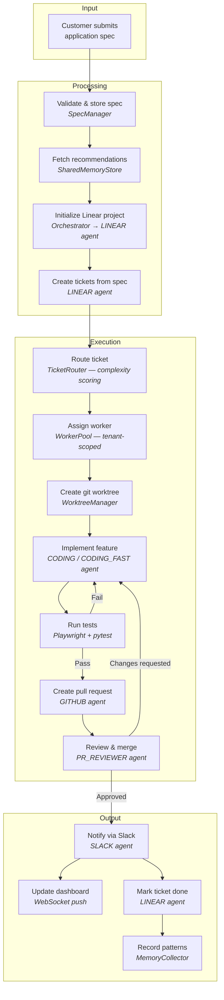
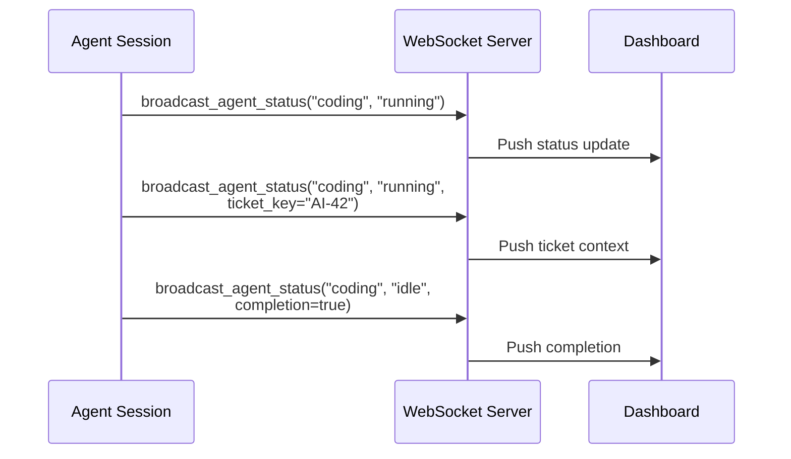
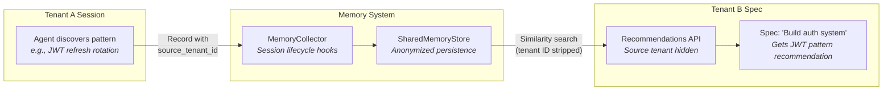

# Data Flow

End-to-end flow from spec submission to project delivery.

## Spec-to-Delivery Pipeline

```mermaid
flowchart TB
    subgraph Input
        SPEC["Customer submits<br/>application spec"]
    end

    subgraph Processing
        VALIDATE["Validate & store spec<br/><i>SpecManager</i>"]
        RECOMMEND["Fetch recommendations<br/><i>SharedMemoryStore</i>"]
        INIT["Initialize Linear project<br/><i>Orchestrator → LINEAR agent</i>"]
        TICKETS["Create tickets from spec<br/><i>LINEAR agent</i>"]
    end

    subgraph Execution
        ROUTE["Route ticket<br/><i>TicketRouter — complexity scoring</i>"]
        ASSIGN["Assign worker<br/><i>WorkerPool — tenant-scoped</i>"]
        WORKTREE["Create git worktree<br/><i>WorktreeManager</i>"]
        CODE["Implement feature<br/><i>CODING / CODING_FAST agent</i>"]
        TEST["Run tests<br/><i>Playwright + pytest</i>"]
        PR["Create pull request<br/><i>GITHUB agent</i>"]
        REVIEW["Review & merge<br/><i>PR_REVIEWER agent</i>"]
    end

    subgraph Output
        NOTIFY["Notify via Slack<br/><i>SLACK agent</i>"]
        DASH["Update dashboard<br/><i>WebSocket push</i>"]
        COMPLETE["Mark ticket done<br/><i>LINEAR agent</i>"]
        MEMORY_STORE["Record patterns<br/><i>MemoryCollector</i>"]
    end

    SPEC --> VALIDATE
    VALIDATE --> RECOMMEND
    RECOMMEND --> INIT
    INIT --> TICKETS
    TICKETS --> ROUTE
    ROUTE --> ASSIGN
    ASSIGN --> WORKTREE
    WORKTREE --> CODE
    CODE --> TEST
    TEST -->|Pass| PR
    TEST -->|Fail| CODE
    PR --> REVIEW
    REVIEW -->|Approved| NOTIFY
    REVIEW -->|Changes requested| CODE
    NOTIFY --> DASH
    NOTIFY --> COMPLETE
    COMPLETE --> MEMORY_STORE
```

## Real-Time Status Flow

```mermaid
sequenceDiagram
    participant Agent as Agent Session
    participant WS as WebSocket Server
    participant Dash as Dashboard

    Agent->>WS: broadcast_agent_status("coding", "running")
    WS->>Dash: Push status update

    Agent->>WS: broadcast_agent_status("coding", "running",<br/>ticket_key="AI-42")
    WS->>Dash: Push ticket context

    Agent->>WS: broadcast_agent_status("coding", "idle",<br/>completion=true)
    WS->>Dash: Push completion
```

## Shared Memory Flow

```mermaid
flowchart LR
    subgraph "Tenant A Session"
        PATTERN_A["Agent discovers pattern<br/><i>e.g., JWT refresh rotation</i>"]
    end

    subgraph "Memory System"
        COLLECTOR["MemoryCollector<br/><i>Session lifecycle hooks</i>"]
        STORE["SharedMemoryStore<br/><i>Anonymized persistence</i>"]
    end

    subgraph "Tenant B Spec"
        REC["Recommendations API<br/><i>Source tenant hidden</i>"]
        SPEC_B["Spec: 'Build auth system'<br/><i>Gets JWT pattern recommendation</i>"]
    end

    PATTERN_A -->|"Record with<br/>source_tenant_id"| COLLECTOR
    COLLECTOR --> STORE
    STORE -->|"Similarity search<br/>(tenant ID stripped)"| REC
    REC --> SPEC_B
```
