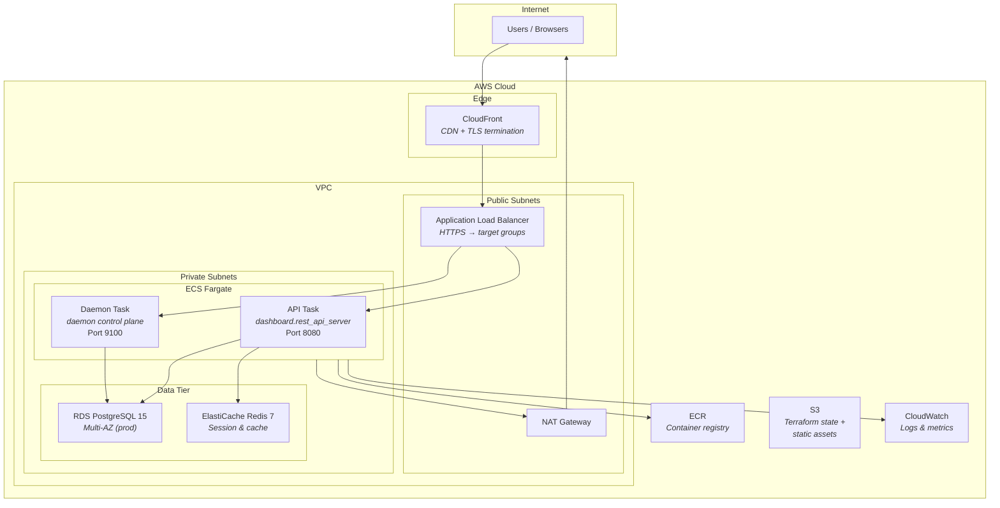
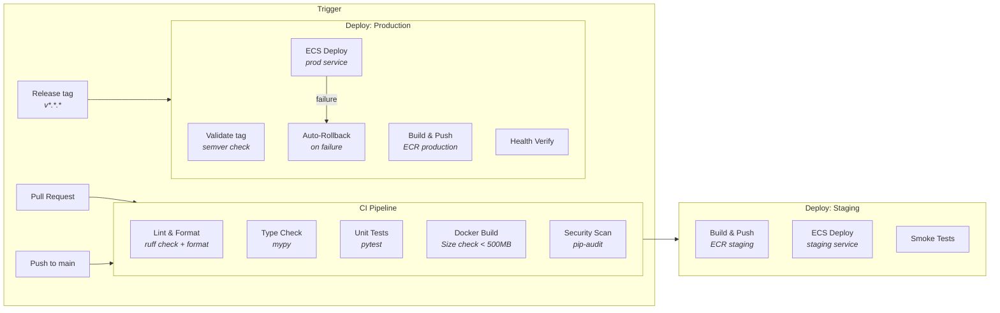
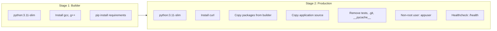

# Deployment Architecture

AWS infrastructure and CI/CD pipeline.

## AWS Infrastructure

## CI/CD Pipeline

## Docker Image

## Environment Matrix

| Environment | Instance | Database | Redis | Auto-Scale |
|------------|----------|----------|-------|------------|
| **Development** | Local | PostgreSQL 15 (Docker) | Redis 7 (Docker) | N/A |
| **Staging** | t3.micro | RDS Single-AZ | ElastiCache | 1-2 tasks |
| **Production** | t3.small+ | RDS Multi-AZ | ElastiCache | 2-10 tasks |
