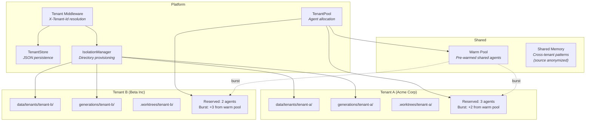
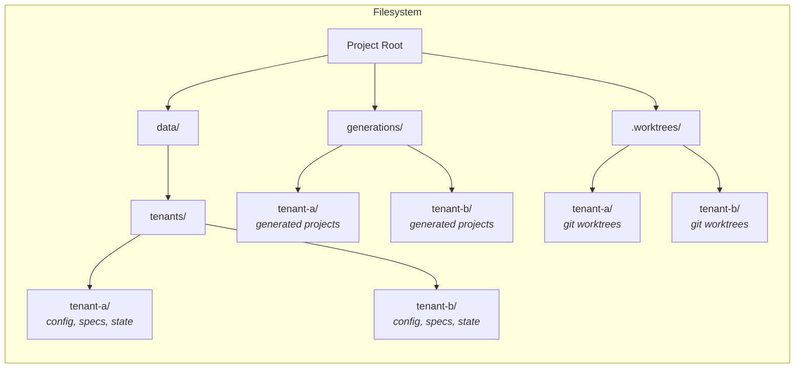
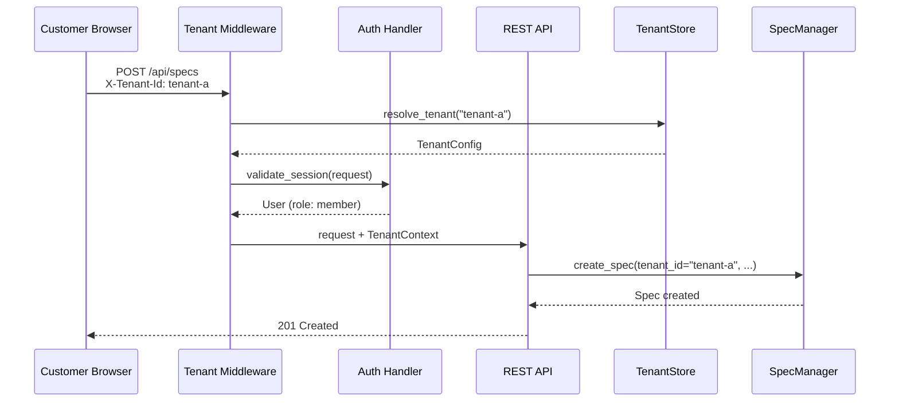

# Multi-Tenant Architecture

Tenant isolation, data partitioning, and resource allocation.

## Tenant Isolation Model

## Data Partitioning

## Request Flow with Tenant Context

## Tenant Configuration

| Field | Description |
|-------|-------------|
| `tenant_id` | Unique identifier (UUID) |
| `name` | Display name (e.g., "Acme Corp") |
| `slug` | URL-safe identifier (e.g., "acme-corp") |
| `max_projects` | Maximum concurrent projects |
| `max_agents` | Maximum concurrent agent workers |
| `reserved_agents` | Guaranteed agent pool slots |
| `sso_config` | SAML/OIDC SSO configuration |
| `created_at` | Tenant creation timestamp |
