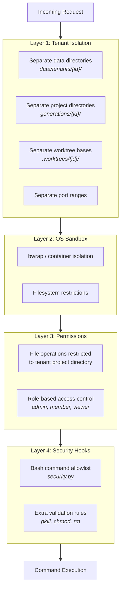
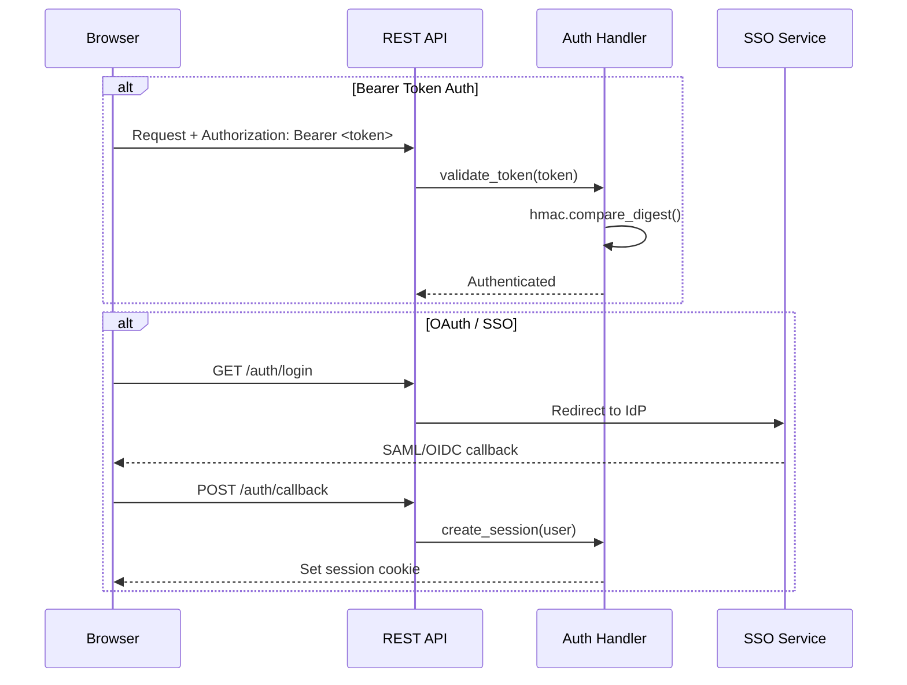
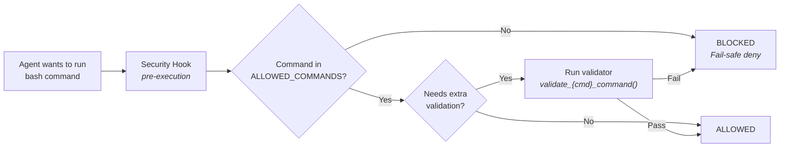

# Security Model

Defense-in-depth security architecture with four layers.

## Security Layers

## Authentication Flow

## Bash Command Security

## Security Rules

| Command | Restriction |
|---------|-------------|
| `pkill` | Only dev processes: `node`, `npm`, `npx`, `vite`, `next` |
| `chmod` | Only `+x` mode |
| `rm` | Blocks system directories (`/`, `/usr`, `/etc`, etc.) |
| `curl`/`wget` | Allowed (sandboxed network) |
| Unlisted commands | Blocked entirely (fail-safe) |

## Authentication Methods

| Method | Layer | Use Case |
|--------|-------|----------|
| **Bearer Token** | API | Dashboard API access, `DASHBOARD_AUTH_TOKEN` env var |
| **SAML 2.0** | SSO | Enterprise IdP integration |
| **OpenID Connect** | SSO | OAuth-based SSO |
| **SCIM 2.0** | Provisioning | Automated user/group sync from IdP |
| **Session Cookie** | Web | Browser-based dashboard sessions |
