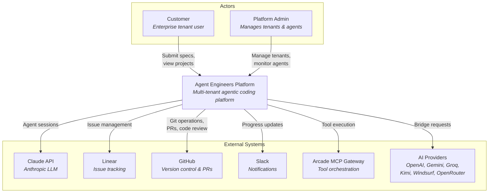

# System Context Diagram (C4 Level 1)

High-level view of the Agent Engineers platform and its external interactions.

## Actors

| Actor | Description |
|-------|-------------|
| **Customer** | Enterprise tenant user who submits application specs and monitors agent progress via the customer dashboard |
| **Platform Admin** | Operator who manages tenants, agent pools, shared memory, and platform configuration |

## External Systems

| System | Integration |
|--------|-------------|
| **Claude API** | Primary LLM for agent sessions via Claude Agent SDK |
| **Linear** | Issue and project management — agents create/update tickets autonomously |
| **GitHub** | Git operations, branch management, pull requests, and code review |
| **Slack** | Progress notifications and status updates |
| **Arcade MCP Gateway** | Tool orchestration layer providing controlled access to external tools |
| **AI Providers** | Alternative LLM providers accessed through the bridge architecture |
